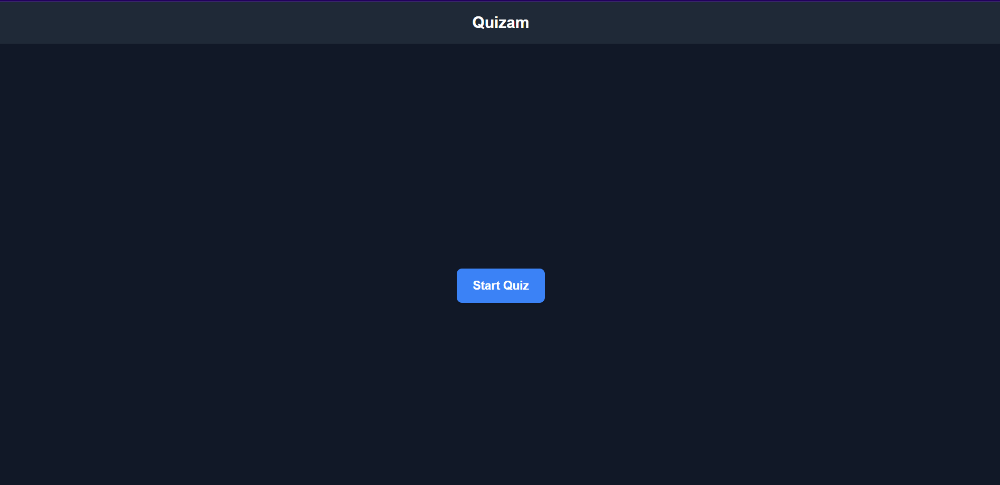
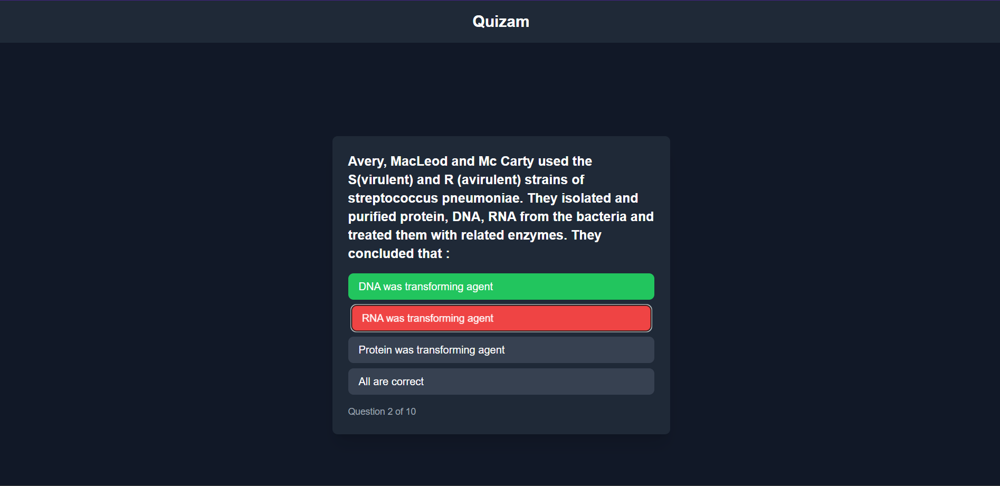
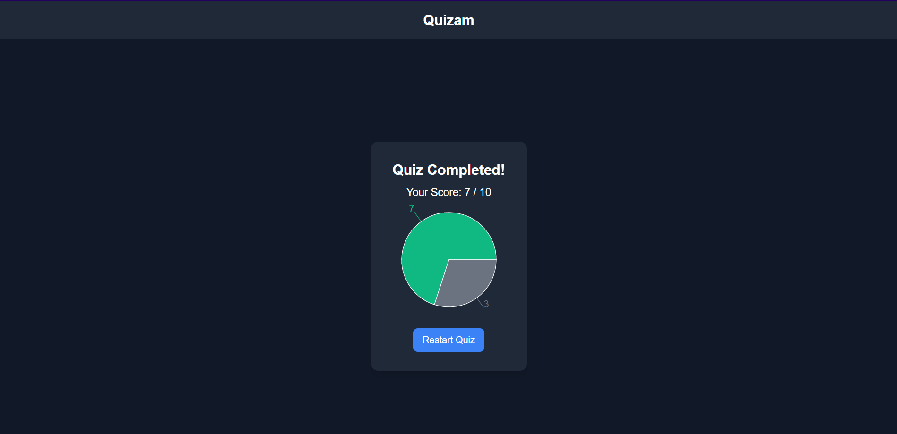

# QUIZAM

## Setup
To setup the project in your local device, 
1. Run npm clone <repository link> in your terminal
2. Navigate into the downloaded folder
3. Run npm install or yarn install in your terminal
4. Run npm run dev in the terminal

## Screenshots

### Start Page

### Quiz questions

### Result Page

